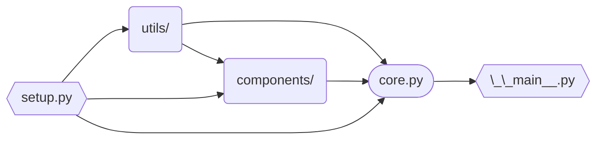

# Ghostty Discord Bot

The [Ghostty Discord][discord-invite] Bot, humorlessly named "Ghostty Bot."

It originally powered the invite system during Ghostty's private beta period,
successfully inviting ~5,000 people.
It now serves as the community's helper bot, making development discussion and
community moderation more efficient.

---

- [Bot setup](#bot-setup)
  - [1. Preparing a Discord application](#1-preparing-a-discord-application)
    - [1.1. Creating a Discord application](#11-creating-a-discord-application)
    - [1.2. Getting a Discord token](#12-getting-a-discord-token)
    - [1.3. Inviting the bot to your server](#13-inviting-the-bot-to-your-server)
  - [2. Getting a GitHub token](#2-getting-a-github-token)
  - [3. Creating a GitHub webhook](#3-creating-a-github-webhook)
  - [4. Preparing a Discord server](#4-preparing-a-discord-server)
  - [5. Preparing the `.env` file](#5-preparing-the-env-file)
  - [6. Running the bot](#6-running-the-bot)
- [Project structure](#project-structure)
- [Features](#features)
  - [`/docs`](#docs)
  - [`/close`](#close)
  - [`#help` channel moderation](#help-channel-moderation)
  - [Entity mentions](#entity-mentions)
    - [Code links](#code-links)
    - [Entity comments](#entity-comments)
    - [Commit mentions](#commit-mentions)
  - [XKCD mentions](#xkcd-mentions)
  - [Zig code blocks](#zig-code-blocks)
  - [Message filters](#message-filters)
  - [Moving messages](#moving-messages)


# Bot setup

> [!warning]
> The bot is tailor-made for the Ghostty community and will most definitely be
> unsuitable for other servers. If you're looking to use similar features, you
> should consider looking for a more general-purpose bot, or forking this
> project and modifying it to suit your needs. That said, the core intent of
> this guide is to help contributors set up their development environment for
> building and testing new features. **Contributions are the goal, not
> standalone usage.**

## 1. Preparing a Discord application

### 1.1. Creating a Discord application

1. Go to the [Discord Developer Portal][discord-docs].
2. Click on the "New Application" button.
3. Pick a name for your bot.


### 1.2. Getting a Discord token

On your newly created bot's dashboard:
1. Go to "Bot" on the sidebar.
2. Click on the "Reset Token" button.
3. Save the newly generated token for later.
4. Under "Privileged Gateway Intents", enable:
   * Server Members Intent
   * Message Content Intent

### 1.3. Inviting the bot to your server
1. Go to "OAuth2" on the sidebar.
2. Under "OAuth2 URL Generator", select the `bot` scope.
3. Under "Bot Permissions" that appears, choose the following permissions:
   * Attach Files
   * Manage Messages
   * Manage Roles
   * Manage Threads
   * Manage Webhooks
   * Send Messages
   * Use External Apps\
   (your URL should contain a `1125917892061184` bitfield for `permissions`)
4. Use the generated URL at the bottom of the page to invite the bot to your
   server.


## 2. Getting a GitHub token

A GitHub token is necessary for the bot's Entity Mentions feature.

You can get one in two ways:
* On GitHub, go to Settings > Developer settings > Personal access tokens >
  Tokens (classic) > Generate new token, or use this link:
  [Generate new token][gh-new-token]. As the bot only accesses public
  repositories, it doesn't require any scopes.
* If you have the `gh` CLI installed and authenticated, run `gh auth token`.


## 3. Creating a GitHub webhook

> [!tip]
> This can be skipped if you're not going to interact with the bot's webhook
> feature.

The bot has a webhook feed feature which lets it stream customized GitHub repo
activity to Discord channels. In order to set up a webhook stream from your
repo:
1. Go to https://smee.io/ (any webhook relay service should work, but smee.io is
   field-tested) and choose "Start a new channel".
2. Copy the URL of your channel.
3. Go to your GitHub repository, then Settings > Webhooks > Add webhook.
4. In "Payload URL", paste in your channel's URL.
5. Set "Content type" to `application/json`.
6. Set a "Secret" (optional, but recommended). It can be any string.
7. For "Which events would you like to trigger this webhook?", it's easiest to
   choose "Send me **everything**." because the bot's webhook client still only
   triggers for events specified by hooks in the code.

More resources:
* *What are webhooks?* — [GitHub Docs][gh-webhook-docs]
* *Why is a secret recommended?* — [Monalisten Docs][monalisten-docs-warning]


## 4. Preparing a Discord server

The following **text** channels will be necessary:
* `#media`
* `#showcase`
* `#webhook`
* `#botlog-everything`

Additionally, a **forum** channel named `#help` is needed. It must have the
following tags:
* Moved to GitHub
* Solved
* Stale
* Duplicate

The following roles will be necessary (both requiring the Manage Messages
permission):
* `mod`
* `helper`


## 5. Preparing the `.env` file

Create a `.env` file in the root of the project based on `.env.example`.
Below are explanations for each variable:
* `BOT_ACCEPT_INVITE_URL`: a URL to visit to accept the Ghostty invite
* Channel/role IDs from [step 4](#4-preparing-a-discord-server):
  * `BOT_GUILD_ID`: the id of the server you prepared (optional; useful when your bot is in multiple servers).
  * `BOT_HELP_CHANNEL_ID`
  * `BOT_HELP_CHANNEL_TAG_IDS`: a comma-separated list of `tag_name:tag_id`
    pairs. The tag names are `moved`, `solved`, `stale` and `duplicate`.
  * `BOT_MEDIA_CHANNEL_ID`
  * `BOT_SHOWCASE_CHANNEL_ID`
  * `BOT_LOG_CHANNEL_ID`
  * `BOT_WEBHOOK_CHANNEL_ID`
  * `BOT_MOD_ROLE_ID`
  * `BOT_HELPER_ROLE_ID`
* `BOT_TOKEN`: the Discord bot token from
  [step 1](#1-creating-a-discord-application).
* `BOT_GITHUB_ORG`: the GitHub organization name.
* `BOT_GITHUB_REPOS`: a comma-separated list of `prefix:repo_name` pairs used for
  entity mention prefixes. The `main`/`bot`/`web` prefixes aren't exactly fixed,
  but some of the bot logic assumes these names (e.g. defaulting to `main`).
* `BOT_GITHUB_TOKEN`: the GitHub token from [step 2](#2-getting-a-github-token).
* `BOT_SENTRY_DSN`: the Sentry DSN (optional).
* Webhook environment variables from [step 3](#3-creating-a-github-webhook) (if
  you skipped that section, you can use the dummy values from `.env.example`):
  * `BOT_GITHUB_WEBHOOK_URL`: the URL to receive events from.
  * `BOT_GITHUB_WEBHOOK_SECRET`: a token for validating events (optional).


## 6. Running the bot

This bot runs on Python 3.13+ and is managed with [uv]. To get started:
1. Install [uv].
2. Run the bot:
   ```console
   $ uv run -m app
   ```
3. After you've made your changes, run the required checks:
   ```console
   $ uv run ruff check
   $ uv run ruff format
   $ uv run basedpyright app tests
   $ uv run taplo fmt pyproject.toml
   $ uv run pytest
   ```
   or, if you have [just] installed:
   ```console
   $ just fix
   $ just check
   ```


# Project structure



* `components/` is a place for all dedicated features, such as message filters
  or entity mentions. Most new features should become modules belonging to this
  package.
* `core.py` loads the `components` package and houses the code for handling the
  most standard bot events (e.g. `on_ready`, `on_message`, `on_error`).
* `setup.py` handles reading and parsing the environment variables and the
  local `.env` file, and creates the Discord and GitHub clients.
* `utils/` contains helper functions/classes not tied to any specific feature.
* `__main__.py` initializes Sentry (optional) and starts the bot.


# Features

## `/docs`

A command for linking Ghostty documentation with autocomplete and an optional
message option:

<p align="center">
  
  
</p>

If a message is provided, a webhook will be used to send the message under the
interactor's server profile.


## `/close`

A command group to mark help channel posts as resolved, with various options for
different resolution scenarios:

| Command            | Applied tag     | Argument                                  | Additional information                             |
| ------------------ | --------------- | ----------------------------------------- | -------------------------------------------------- |
| `/close solved`    | Solved          | Config option (optional)                  | Links to config documentation (if option provided) |
| `/close wontfix`   | Stale           | -                                         | Adds "WONTFIX" to post title                       |
| `/close stale`     | Stale           | -                                         | -                                                  |
| `/close moved`     | Moved to GitHub | GitHub entity number                      | Links to the GitHub entity                         |
| `/close duplicate` | Duplicate       | Help post ID/link or GitHub entity number | Links to original post or GitHub entity            |


## `#help` channel moderation

Similar to [`/close`](#close), posts in the `#help` channel are automatically
closed after one day of inactivity when they have been marked as solved using
the post tags.  Information about a `#help` channel scan is also published in
the bot log channel.

Bumps to old solved posts (older than one month) are also handled by warning the
user and locking the thread, to prevent often unrelated help requests in posts
that are no longer relevant.


## Entity mentions

Automatic links to Ghostty's GitHub issues/PRs/discussions ("entities") when a
message contains GitHub-like mentions (`#1234`). It reacts to message edits and
deletions for 24 hours, while also providing a "❌ Delete" button for 30 seconds
in case of false positives. A "❄️ Freeze" button is also provided to stop
reacting to message edits and deletions. Mentioning entities in other
ghostty-org repos is supported with prefixes:
* `web` or `website` for [ghostty-org/website][website-repo], e.g. `web#78`
* `bot`, `bobr`, or `discord-bot` for [ghostty-org/discord-bot][bot-repo], e.g. `bot#98`
* `main` or `ghostty` for [ghostty-org/ghostty][main-repo] (default), e.g. `main#2137` or
  just `#2137`

On top of that, any GitHub repository can be mentioned, either with
`owner/repo#1` (e.g. `astral-sh/uv#8020`), or `repo#1`, where the bot will
try finding the most popular repo with that name (e.g. `rust#105586`).

A full GitHub URL (such as `https://github.com/ghostty-org/ghostty/pull/4876`)
will also be responded to in a similar fashion, and the original GitHub embed
will be suppressed.

The bot also keeps a TTR cache to avoid looking up the same entity multiple
times (with data being refetched 30 minutes since last use), making the bot more
responsive (the example below can take ~2s on first lookup and ~5ms on
subsequent lookups).


### Code links

Ghostty Bot responds to GitHub code range links with code blocks containing the
linked code. Same edit/delete hook and TTR cache rules apply.


### Entity comments

Comments on issues, PRs, and discussions are displayed by the bot when linked.
A subset of GitHub events (e.g. "requested review", "closed the issue", "added
label") is also supported. Same edit/delete hook and TTR cache rules apply.


### Commit mentions

Ghostty Bot responds to messages containing commit hashes (such as `b7913f0` or
`a8b9dd8dfc7a2cd6bb3f19969a450497654a47b0`) with information about the mentioned
commit. The same prefixes used for entity mentions is also supported by using an
`@`; e.g. `bot@4841da1`. Arbitrary repositories can also be mentioned with a
syntax similar to entity mentions; e.g. `python/cpython@2a6888e` or
`zig@39aca6f37e83e263236339f9`.


## XKCD mentions

Similar to the above feature, entity mentions with a prefix of `xkcd`, such as
`xkcd#1172`, will be replied to with an embed containing the XKCD's contents.
Message edits and deletion are also handled, and a "❌ Delete" button is
provided for one hour. A "❄️ Freeze" button is also provided to stop reacting to
message edits and deletions.


## Zig code blocks

Ghostty Bot looks for any code blocks with the language set to `zig` and
responds with custom `ansi` code blocks that contain correctly
syntax-highlighted Zig code (since Discord doesn't support Zig).
Replies include a dismiss button, plus:
* a **Freeze** button: stops the bot from reacting to edits/deletion of the
  original message (useful if the author wants to remove their unhighlighted
  code block but keep the bot's reply),
* a **Replace my message** button (for shorter messages only): deletes both the
  original and the bot's reply, then resends the original message via webhook
  as the original author, but with proper syntax highlighting.

The bot can also highlight Zig code in `.zig` attachments.


<sub>This feature relies on [trag1c/zig-codeblocks][zig-codeblocks-repo]! ^^</sub>


## Message filters

This feature takes care of keeping the `#showcase` and `#media` channels clean.
The bot will delete any message:
* without an attachment in `#showcase`
* without a link in `#media`

It will also DM users about the deletion and provide an explanation to make it
less confusing:


## Moving messages

Used for moving messages to more fitting channels (e.g. off-topic questions
in `#development` to `#tech`).


Ghostty troubleshooting questions can be turned into `#help` posts with a
related feature:


The author of a message can also modify moved messages using an entry in the
context menu, which gives them the following:
* a **Delete** button: removes the moved message, without any further
  confirmation.
* an **Edit via modal** button: displays a text box to them that is pre-filled
  with the existing message content, allowing them to modify it almost like with
  the normal Discord edit option.
* an **Edit in thread** button: creates a new private thread in the current
  channel, adds them to it, then provides them with instructions on how to
  continue. In channels that don't support private threads, this button isn't
  shown.
* a **Help** button: displays information about both editing options to them.

If the message has one attachment, a "Remove attachment" button is also shown,
which removes the attachment without any further confirmation; if the message
has multiple attachments, a "Remove attachments" button is shown which provides
the user with a selection menu that allows them to select which attachments are
to be removed.

https://github.com/user-attachments/assets/8c8ed1cf-db00-414f-937f-43e565ae9d15

[bot-repo]: https://github.com/ghostty-org/discord-bot
[discord-docs]: https://discord.com/developers/applications
[discord-invite]: https://discord.gg/ghostty
[gh-new-token]: https://github.com/settings/tokens/new
[gh-webhook-docs]: https://docs.github.com/en/webhooks/about-webhooks
[monalisten-docs-warning]: https://github.com/trag1c/monalisten#foreword-on-how-this-works
[just]: https://just.systems/
[main-repo]: https://github.com/ghostty-org/ghostty
[uv]: https://docs.astral.sh/uv/
[website-repo]: https://github.com/ghostty-org/website
[zig-codeblocks-repo]: https://github.com/trag1c/zig-codeblocks
