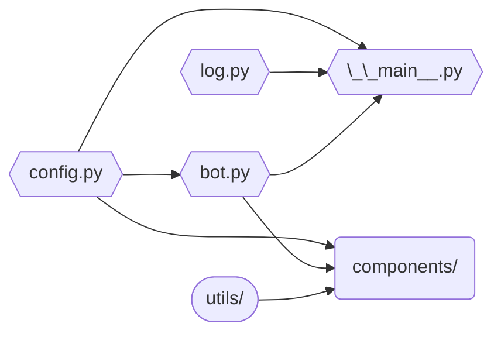

# Github Discord Bot

Forked from [Ghostty's Discord Bot](https://github.com/ghostty/discord-bot), this bot provides GitHub integration features for Discord servers, such as automatic linking of issues and pull requests when they are mentioned in chat.

---

- [Bot setup](#bot-setup)
  - [1. Preparing a Discord application](#1-preparing-a-discord-application)
    - [1.1. Creating a Discord application](#11-creating-a-discord-application)
    - [1.2. Getting a Discord token](#12-getting-a-discord-token)
    - [1.3. Inviting the bot to your server](#13-inviting-the-bot-to-your-server)
  - [2. Getting a GitHub token](#2-getting-a-github-token)
  - [3. Creating a GitHub webhook](#3-creating-a-github-webhook)
  - [4. Preparing a Discord server](#4-preparing-a-discord-server)
  - [5. Preparing the `.env` file](#5-preparing-the-env-file)
  - [6. Running the bot](#6-running-the-bot)
- [Project structure](#project-structure)
- [Features](#features)
  - [Entity mentions](#entity-mentions)
    - [Code links](#code-links)
    - [Entity comments](#entity-comments)
    - [Commit mentions](#commit-mentions)
  - [XKCD mentions](#xkcd-mentions)


# Bot setup

## 1. Preparing a Discord application

### 1.1. Creating a Discord application

1. Go to the [Discord Developer Portal][discord-docs].
2. Click on the "New Application" button.
3. Pick a name for your bot.

### 1.2. Getting a Discord token

On your newly created bot's dashboard:
1. Go to "Bot" on the sidebar.
2. Click on the "Reset Token" button.
3. Save the newly generated token for later.
4. Under "Privileged Gateway Intents", enable:
   * Server Members Intent
   * Message Content Intent

### 1.3. Inviting the bot to your server
1. Go to "OAuth2" on the sidebar.
2. Under "OAuth2 URL Generator", select the `bot` scope.
3. Under "Bot Permissions" that appears, choose the following permissions:
   * Attach Files
   * Manage Messages
   * Manage Roles
   * Manage Threads
   * Manage Webhooks
   * Send Messages
   * Use External Apps\
   (your URL should contain a `1125917892061184` bitfield for `permissions`)
4. Use the generated URL at the bottom of the page to invite the bot to your
   server.

## 2. Getting a GitHub token

A GitHub token is necessary for the bot's Entity Mentions feature.

You can get one in two ways:
* On GitHub, go to Settings > Developer settings > Personal access tokens >
  Tokens (classic) > Generate new token, or use this link:
  [Generate new token][gh-new-token]. As the bot only accesses public
  repositories, it doesn't require any scopes.
* If you have the `gh` CLI installed and authenticated, run `gh auth token`.

## 4. Preparing a Discord server

The following **text** channels will be necessary:
- `#botlog-everything`

Additionally, the bot requires the following configuration:
- `BOT_GITHUB_ORG`: the GitHub organization name.

No other channels or roles are required for the features this bot provides.


## 5. Preparing the `.env` file

Create a `.env` file in the root of the project based on `.env.example`.
Below are explanations for each variable:
- Channel IDs from [step 4](#4-preparing-a-discord-server):
  - `BOT_GUILD_ID`: the id of the server you're running the bot in (optional; useful when your bot is in multiple servers).
  - `BOT_LOG_CHANNEL_ID`
  - `BOT_WEBHOOK_CHANNEL_IDS`: a comma-separated list of `feed_type:channel_id` pairs. The feed type names are `main`.
- `BOT_TOKEN`: the Discord bot token from [step 1](#1-creating-a-discord-application).
- `BOT_GITHUB_TOKEN`: the GitHub token from [step 2](#2-getting-a-github-token).

## 6. Running the bot

This bot runs on Python 3.13+ and is managed with [uv]. To get started:
1. Install [uv].
2. Run the bot:
   ```console
   $ uv run -m app
   ```
3. After you've made your changes, run the required checks:
   ```console
   $ uv run ruff check
   $ uv run ruff format
   $ uv run basedpyright app
   $ uv run taplo fmt pyproject.toml
   ```
   or, if you have [just] installed:
   ```console
   $ just fix
   $ just check
   ```

# Project structure



* `components/` is a place for all dedicated features ([cogs]), such as message
  filters or entity mentions. Most new features should become modules belonging
  to this package. Events (e.g. `on_ready`, `on_message`, `on_error`) should be
  defined within the component.
* `bot.py` contains custom attributes and behaviors for the overall Discord bot
  and then loads extensions found in `components`.
* `config.py` handles reading and parsing the environment variables and the
  local `.env` file, and creates the GitHub client.
* `utils/` contains helper functions/classes not tied to any specific feature.
* `log.py` setups up logging.
* `__main__.py` initializes logging and starts the bot.

## Features

### Entity mentions

Automatic links to GitHub issues/PRs ("entities") when a
message contains GitHub-like mentions (`#1234`). It reacts to message edits and
deletions for 24 hours, while also providing a "❌ Delete" button for 30 seconds
in case of false positives. A "❄️ Freeze" button is also provided to stop
reacting to message edits and deletions.

On top of that, any GitHub repository can be mentioned, either with
`owner/repo#1` (e.g. `astral-sh/uv#8020`), or `repo#1`, where the bot will
try finding the most popular repo with that name (e.g. `rust#105586`).

A full GitHub URL (such as `https://github.com/ghostty-org/ghostty/pull/4876`)
will also be responded to in a similar fashion, and the original GitHub embed
will be suppressed.

The bot also keeps a TTR cache to avoid looking up the same entity multiple
times (with data being refetched 30 minutes since last use), making the bot more
responsive (the example below can take ~2s on first lookup and ~5ms on
subsequent lookups).


#### Code links

Bot responds to GitHub code range links with code blocks containing the
linked code. Same edit/delete hook and TTR cache rules apply.


#### Entity comments

Comments on issues and PRs are displayed by the bot when linked.
A subset of GitHub events (e.g. "requested review", "closed the issue", "added
label") is also supported. Same edit/delete hook and TTR cache rules apply.


#### Commit mentions

Bot responds to messages containing commit hashes (such as `b7913f0` or
`a8b9dd8dfc7a2cd6bb3f19969a450497654a47b0`) with information about the mentioned
commit. The same prefixes used for entity mentions is also supported by using an
`@`; e.g. `bot@4841da1`. Arbitrary repositories can also be mentioned with a
syntax similar to entity mentions; e.g. `python/cpython@2a6888e` or
`zig@39aca6f37e83e263236339f9`.


### XKCD mentions

Similar to the above feature, entity mentions with a prefix of `xkcd`, such as
`xkcd#1172`, will be replied to with an embed containing the XKCD's contents.
Message edits and deletion are also handled, and a "❌ Delete" button is
provided for one hour. A "❄️ Freeze" button is also provided to stop reacting to
message edits and deletions.


[discord-docs]: https://discord.com/developers/applications
[gh-new-token]: https://github.com/settings/tokens/new
[gh-webhook-docs]: https://docs.github.com/en/webhooks/about-webhooks
[monalisten-docs-warning]: https://github.com/trag1c/monalisten#foreword-on-how-this-works
[just]: https://just.systems/
[main-repo]: https://github.com/ghostty-org/ghostty
[uv]: https://docs.astral.sh/uv/
